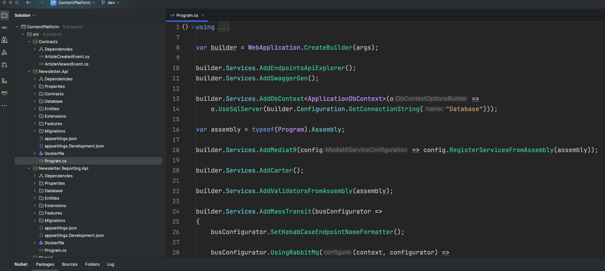

# MicroservicesWithMassTransitandRabbitMQ (Demo App)

The GitHub repository MicroservicesWithMassTransitandRabbitMQ provides a sample implementation of an ASP.NET Web API microservices architecture, utilizing MassTransit to facilitate communication with RabbitMQ. This setup demonstrates how to build scalable and decoupled applications by leveraging message-based communication between services.

Key Components:

ASP.NET Web API: Serves as the framework for building HTTP-based services, enabling the creation of RESTful APIs.

MassTransit: A .NET-based Enterprise Service Bus (ESB) that simplifies the development of message-based applications. It supports various messaging patterns, including publish/subscribe, request/response, and sagas for complex workflows. 
EN.WIKIPEDIA.ORG

RabbitMQ: A robust message broker that facilitates the exchange of messages between different parts of an application, ensuring reliable and asynchronous communication.

By integrating MassTransit with RabbitMQ, the repository showcases how to implement effective communication strategies within a microservices architecture, promoting scalability, maintainability, and resilience in distributed systems.

### Credits

* ASP.NET Core Minimal API: https://learn.microsoft.com/en-us/aspnet/core/fundamentals/minimal-apis/overview?view=aspnetcore-9.0
* MassTransit.RabbitMQ: https://www.nuget.org/packages/MassTransit.RabbitMQ
* MediatR: https://www.nuget.org/packages/MediatR
* Carter: https://www.nuget.org/packages/Carter
* FluentValidation.DependencyInjectionExtensions: https://www.nuget.org/packages/FluentValidation.DependencyInjectionExtensions

* Mapster: https://www.nuget.org/packages/Mapster
* Microsoft.EntityFrameworkCore.SqlServer: https://www.nuget.org/packages/Microsoft.EntityFrameworkCore.SqlServer
* Microsoft.EntityFrameworkCore.Tools: https://www.nuget.org/packages/Microsoft.EntityFrameworkCore.Tools
* Microsoft.VisualStudio.Azure.Containers.Tools.Targets: https://www.nuget.org/packages/Microsoft.VisualStudio.Azure.Containers.Tools.Targets
* Swashbuckle.AspNetCore: https://www.nuget.org/packages/Swashbuckle.AspNetCore

